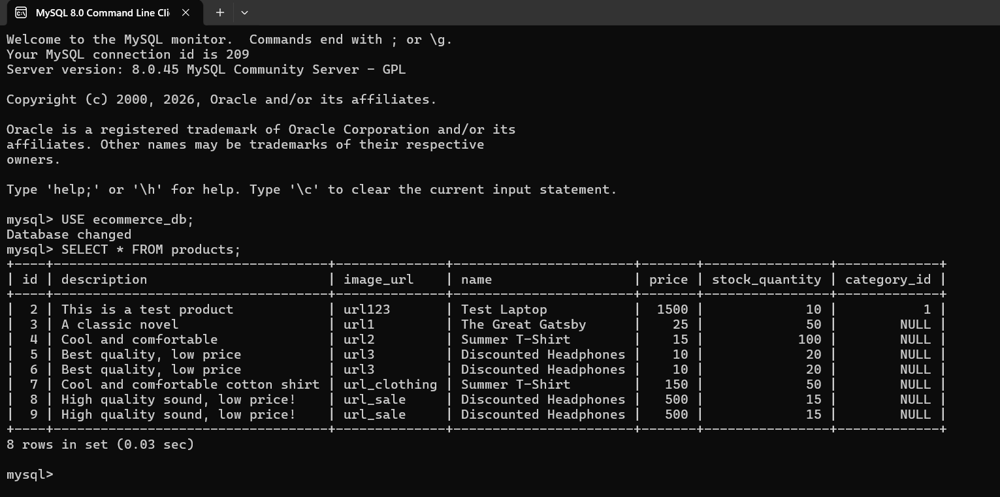
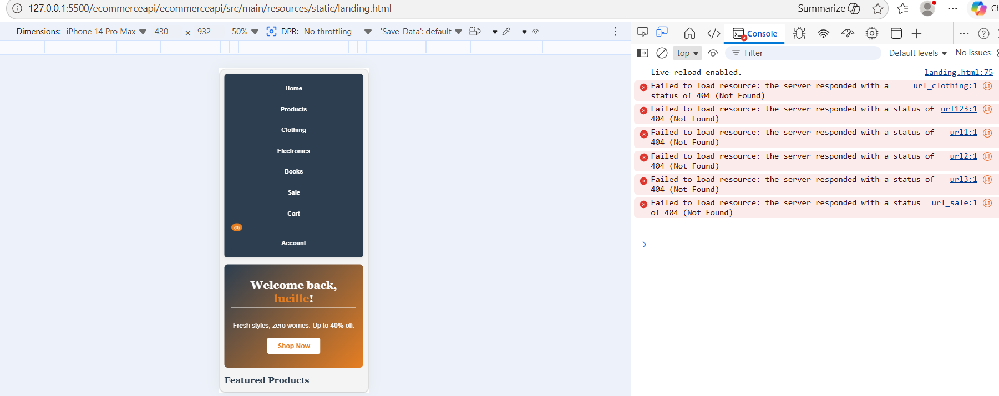

# E-Commerce API

# Overview
This is a secure e-commerce backend application built with Spring Boot. It uses session-based authentication to protect resources and provides RESTful API endpoints for frontend integration.


## Setup Instructions

### Prerequisites
- Java Development Kit (JDK) 17 or higher
- Maven or Gradle build tool
- IDE (IntelliJ IDEA, Eclipse, or VS Code)

### How to Run
1. Clone the repository:
   ```bash
   git clone https://github.com/lucillerapsing31-svg/ecommerce-api.git

 2.  Navigate to the project folder:
    ```bash
   cd ecommerce-api

 3. Build and run the application using Maven:
   ```bash
   mvn spring-boot:run

 4. The server will start on port 8080. 
   ```bash 
   Base URL: http://localhost:8080/api/v1


# API Endpoints
Method  | Endpoint                    | Description 

 GET    | `/products`                 | Get all products 
 GET    | `/products/{id}`            | Get product by ID 
 POST   |  `/products`                | Create new product 
 PUT    | `/products/{id}`            | Update product 
 DELETE | `/products/{id}`            | Delete product
 GET    | `/products/filter/name`     | Filter by name 
 GET    | `/products/filter/category` | Filter by category 
 GET    | `/products/filter/price`    | Filter by price range 

Example Request (POST /products)
Body:
{
  "name": "Sample Product",
  "description": "Product description",
  "price": 100.00,
  "category": "Electronics",
  "stockQuantity": 10
}

Error Handling
ProductNotFoundException: Custom exception returned when product ID is not found.
Uses standard HTTP Status Codes: 200 OK, 404 Not Found, 400 Bad Request.

## Database Schema

  Table Name | Columns 

  products   | id, name, description, price, stockQuantity, imageUrl, category_id 
  categories | id, name 
  orders     | id, orderDate, totalAmount, user_id 
  order_items| id, quantity, price, product_id, order_id 
  users      | id, username, password, email, role 

# Relationships:
- One Category → Many Products
- One Order → Many Order Items
- One Product → Many Order Items 

Table Name	    Columns
products	      id, name, description, price, stockQuantity, imageUrl, category_id
categories	    id, name
orders	        id, orderDate, totalAmount, user_id
order_items	    id, quantity, price, product_id, order_id
users	          id, username, password, email, role

<<<<<<< HEAD


=======


>>>>>>> 075ee3cfdb05cfd1c9c8457cab8f301293abb6e3


# Security Architecture
This application uses Session-Based Authentication to manage user access. Here is how the security system works:

1. User Login Process
    - When a user sends their email and password to the `/login` endpoint, the backend verifies the credentials.
    - If valid, the server creates a server-side session and stores user information securely.
    - The server sends back a `JSESSIONID` cookie to the user's browser.

2. Session Management
    - The `JSESSIONID` cookie is automatically sent with every request from the browser.
    - The backend uses this cookie to identify the user and load their session data.
    - All sensitive operations check for a valid session before allowing access.

3. Access Control
    -Public Endpoints: Can be accessed by anyone without login.
    -Protected Endpoints: Require a valid session. If no session exists, the server returns `401 Unauthorized`.

4. Logout Process
    - When a user visits `/logout`, the server invalidates the session and removes the cookie.
    - The user is logged out and can no longer access protected resources.

# Validation Rules
All user input and data are validated to ensure security and data integrity.

# User Entity
Field             | Requirements 
`fullname`        | Required, minimum 2 characters, cannot be empty 
`email`           | Required, must be valid email format, must be unique (no duplicate accounts) 
`password`        | Required, minimum 6 characters, encrypted using BCrypt algorithm |
`confirmPassword` | Must match exactly with `password` field 
`role`            | Allowed values: `USER`, `ADMIN` (default: `USER`) 

# Product Entity
 Field         | Requirements 
 `name`        | Required, cannot be empty 
 `price`       | Required, must be a positive number (greater than 0) 
 `description` | Optional, maximum 255 characters 

# Order Entity
Field             | Requirements 
`shippingAddress` | Required, cannot be empty 
`paymentMethod`   | Required, allowed values: `Credit Card`, `Cash on Delivery` 
`items`           | Required, cannot be empty list 


# API Reference
List of all available endpoints and their authentication requirements:

HTTP Method | Endpoint                | Authentication             | Description 
`POST`      | `/api/v1/auth/register` | ❌ Public                 | Create new user account 
`POST`      | `/login`                | ❌ Public                 | User login, creates session cookie 
`POST`      | `/logout`               | ✅ Required               | Logout user, destroys session 
`GET`       | `/api/v1/products`      | ❌ Public / ✅ Protected  | Get list of all products 
`POST`      | `/api/v1/orders`        | ✅ Required               | Create new order 
`GET`       | `/api/v1/orders`        | ✅ Required               | Get user order history 

# Notes:
- Endpoints marked ✅ Required need an active `JSESSIONID` cookie to work.
- Endpoints marked ❌ Public can be accessed without logging in.
- Accessing a protected endpoint without a valid session returns `401 Unauthorized`.


# How to Run
1.  Start the backend server on port `8080`
2.  Open frontend files (using Live Server or browser) on port `5500`
3.  Test API using Postman or frontend interface


# Technologies
- Backend: Spring Boot
- Security: Spring Security, BCrypt Password Encoder
- Database: [Add your database here]
- Frontend: HTML, CSS, JavaScript


# Contributors:
Gepollo, Malou C.
Rapsing, Lucille A.
