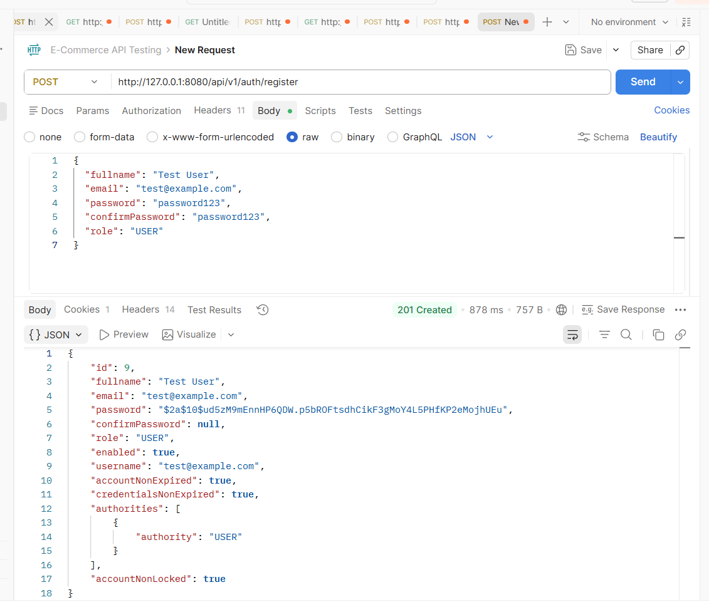
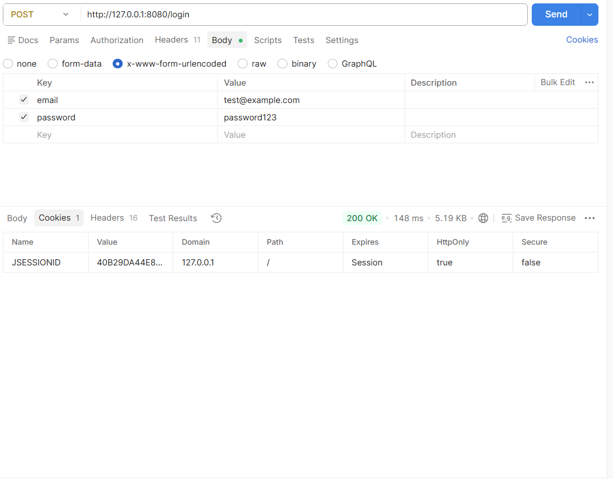
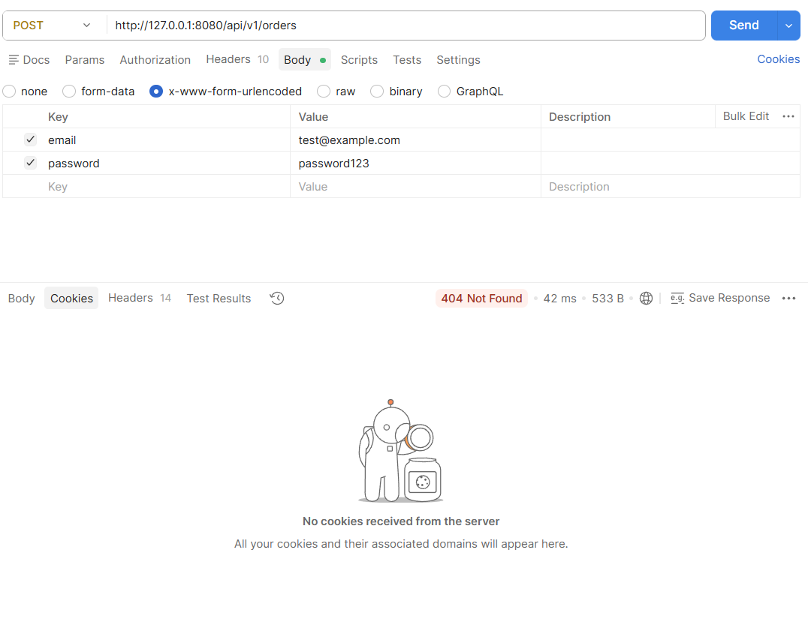

# Proof of Authentication Implementation

This document contains screenshots and evidence showing that the authentication system works correctly as required.

# 1. Registration Test
Status: Successful
- Endpoint: `POST /api/v1/auth/register`
- Result: `201 Created`
- Evidence: User account was created successfully and saved to database.

# 2. Login Test
Status: Successful
- Endpoint: `POST /login`
- Result: `200 OK`
- Evidence: `JSESSIONID` cookie is created and stored, confirming active session.

# 3. Protected Access Test - Logged In
Status: Successful
- Endpoint: `GET /api/v1/products`
- Condition: User is logged in (session cookie present)
- Result: `200 OK`
- Evidence: Protected endpoint can be accessed with valid session.

# 4. Protected Access Test - Not Logged In
**Status: Failed (As Expected)**
- Endpoint: `GET /api/v1/products`
- Condition: User is NOT logged in (session cookie removed)
- Result: `401 Unauthorized`
- Evidence: Access is denied when no valid session exists.

# Summary:
All authentication requirements are met:
- Public endpoints work without login
- Protected endpoints require valid session
- Logout functionality works correctly
- Security rules are implemented and tested